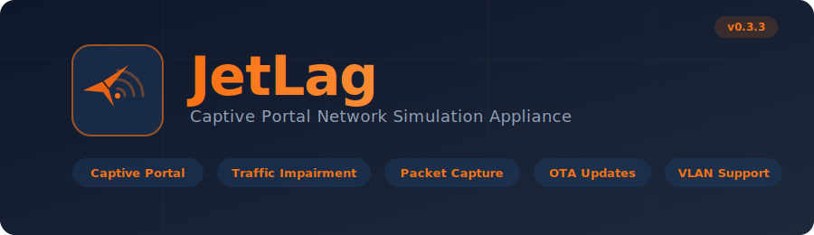
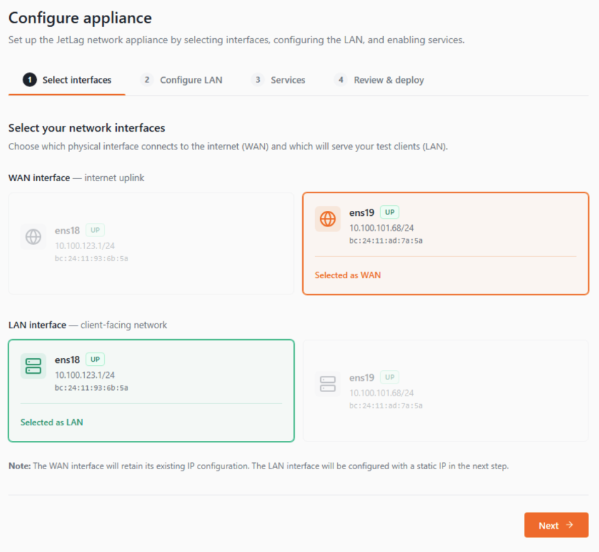
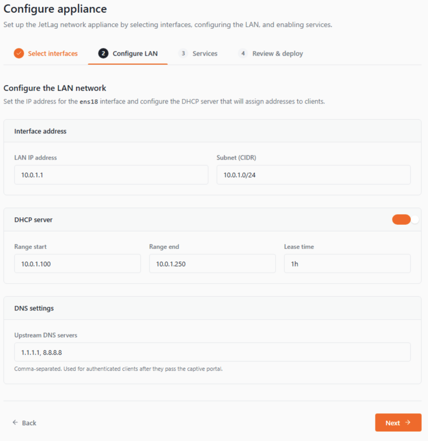
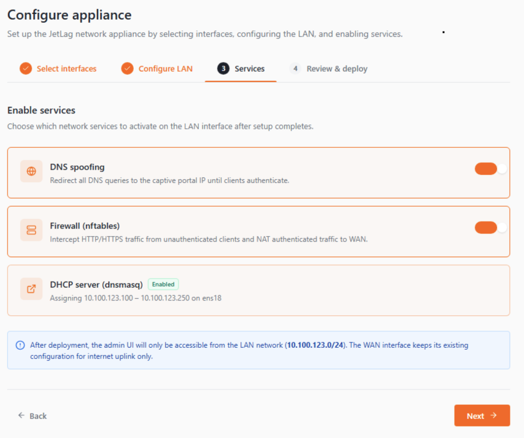
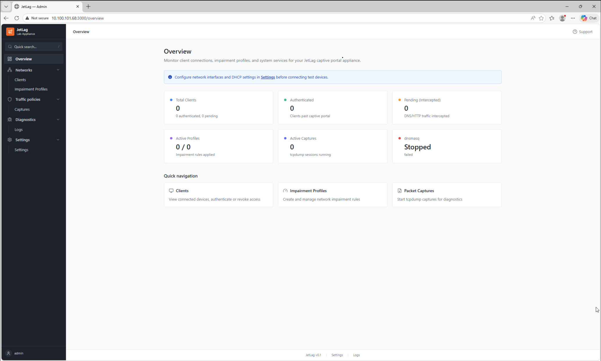

<p align="center">
  
</p>

<p align="center">
  
  
  
  
  
  
</p>

<p align="center">
  A Linux-based virtual appliance that simulates hostile captive portal network environments<br/>
  for testing VPN clients, Zero Trust agents, and network-aware applications.
</p>

---

## What is JetLag?

JetLag recreates the kind of restrictive, unreliable Wi-Fi found on airplanes, hotels, and conference venues. Connect test devices to JetLag's LAN port, and they experience a **fully realistic captive portal** — complete with DNS interception, HTTP redirect, terms-of-service acceptance, and configurable network impairment (latency, jitter, packet loss, bandwidth caps).

It's designed for QA teams who need to **repeatably test** how their products behave on bad networks, without leaving the lab.

### Key Capabilities

| Feature | Description |
|---|---|
| **Captive Portal** | Fully functional TOS-gated portal with DNS spoofing, nftables DNAT, and per-client authentication |
| **Traffic Impairment** | tc/netem profiles — latency, jitter, packet loss, bandwidth limits, corruption, reordering |
| **Packet Capture** | Start/stop tcpdump sessions from the UI, download PCAPs for analysis |
| **Client Management** | Track connected devices, view DHCP leases, authenticate or revoke access per client |
| **VLAN Support** | Tag LAN ports with 802.1Q VLAN IDs for multi-segment test topologies |
| **OTA Updates** | Self-updating from GitHub releases with automatic rollback on failure |
| **Multi-WAN / Multi-LAN** | Configure multiple upstream and client-facing interfaces |

---

## Screenshots

### Setup Wizard

JetLag ships with a guided setup wizard that walks you through interface selection, LAN configuration, and service activation.

<p align="center">
  <br/>
  <em>Step 1 — Select WAN and LAN interfaces</em>
</p>

<p align="center">
  <br/>
  <em>Step 2 — Configure LAN IP, DHCP range, and DNS</em>
</p>

<p align="center">
  <br/>
  <em>Step 3 — Enable DNS spoofing, firewall, and DHCP</em>
</p>

### Admin Dashboard

<p align="center">
  <br/>
  <em>Overview dashboard — client stats, active profiles, service health</em>
</p>

---

## Architecture

```
┌────────────────────────────────────────────────────────────┐
│                      JetLag Appliance                      │
│                                                            │
│   ┌───────────┐   ┌───────────┐   ┌──────────────────┐   │
│   │ Admin UI  │   │  Captive  │   │ Network Services │   │
│   │ React SPA │   │  Portal   │   │ dnsmasq  nftables│   │
│   │ :3000     │   │ :80/:443  │   │ tc/netem tcpdump │   │
│   └─────┬─────┘   └─────┬─────┘   └────────┬─────────┘   │
│         │               │                   │             │
│   ┌─────┴───────────────┴───────────────────┴──────────┐  │
│   │             FastAPI Backend (:8080)                 │  │
│   │        SQLite + Alembic  │  Service Layer          │  │
│   └────────────────────────────────────────────────────┘  │
│                                                            │
│   ┌──────────┐                          ┌──────────┐      │
│   │ WAN port │ ◄── Internet uplink      │ LAN port │      │
│   │ (eth0)   │                          │ (eth1)   │      │
│   └──────────┘                          └──────────┘      │
└────────────────────────────────────────────────────────────┘
        ▲                                       │
        │                                       ▼
   ┌─────────┐                          ┌──────────────┐
   │ Internet│                          │ Test Devices │
   └─────────┘                          └──────────────┘
```

---

## Quick Start

### Prerequisites

| Requirement | Version | Notes |
|---|---|---|
| **Python** | 3.11+ | Backend runtime |
| **Node.js** | 20+ | Frontend build |
| **Ubuntu Server** | 22.04+ | Production deployment (nftables, tc, dnsmasq) |

### One-Command Dev Start

Installs all dependencies and launches both servers:

```bash
# Linux / macOS
bash scripts/start-dev.sh
```

This starts:
- **Backend API** at `http://localhost:8080`
- **Frontend Admin UI** at `http://localhost:5173`

Press `Ctrl+C` to stop both.

### Manual Setup

<details>
<summary><strong>Backend</strong></summary>

```bash
cd backend
python -m venv venv
source venv/bin/activate        # Linux/macOS
# venv\Scripts\activate         # Windows
pip install -r requirements.txt
uvicorn app.main:app --host 0.0.0.0 --port 8080 --reload
```

</details>

<details>
<summary><strong>Frontend</strong></summary>

```bash
cd frontend
npm install
npm run dev
```

</details>

### Production Deployment (Linux, requires root)

```bash
sudo ./scripts/setup.sh
```

This installs system packages (`dnsmasq`, `nftables`, `conntrack`, `iproute2`, `tcpdump`), generates a self-signed SSL certificate, disables `systemd-resolved`, enables IP forwarding, and sets up the Python virtual environment.

Then install and enable the systemd service:

```bash
sudo ./scripts/install-service.sh
```

---

## How It Works

### Captive Portal Flow

```
Client connects to LAN
        │
        ▼
   DHCP lease from dnsmasq
        │
        ▼
   DNS queries ──► DNAT to appliance (port 53)
   HTTP/HTTPS  ──► DNAT to appliance (port 8080)
        │
        ▼
   FastAPI middleware detects Host header mismatch
        │
        ▼
   Serves captive portal TOS page
        │
        ▼
   Client accepts ──► IP added to nftables authenticated_ips set
        │                conntrack flushed for clean handoff
        ▼
   DNS resolves normally, traffic NAT'd to WAN
```

### Impairment Profiles

Profiles use Linux `tc/netem` to shape traffic on LAN interfaces:

| Parameter | Range | Example |
|---|---|---|
| **Latency** | 0 – 5000 ms | 200 ms (simulates satellite link) |
| **Jitter** | 0 – 2000 ms | 50 ms |
| **Packet loss** | 0 – 100% | 5% |
| **Bandwidth** | 1 kbit – 1 gbit | 512 kbit (airline Wi-Fi) |
| **Corruption** | 0 – 100% | 0.1% |
| **Reordering** | 0 – 100% | 2% |

---

## Project Structure

```
jetlag/
├── backend/                    # FastAPI backend
│   ├── app/
│   │   ├── main.py             # App entrypoint + middleware
│   │   ├── config.py           # YAML config loader + models
│   │   ├── database.py         # SQLite + Alembic migrations
│   │   ├── models/             # SQLAlchemy ORM models
│   │   ├── schemas/            # Pydantic request/response schemas
│   │   ├── routers/            # API route handlers
│   │   │   ├── setup.py        # Setup wizard endpoints
│   │   │   ├── clients.py      # Client management
│   │   │   ├── profiles.py     # Impairment profiles
│   │   │   ├── captures.py     # Packet capture
│   │   │   ├── portal.py       # Captive portal accept/status
│   │   │   ├── updates.py      # OTA update management
│   │   │   └── ...
│   │   └── services/           # Business logic
│   │       ├── firewall.py     # nftables wrapper
│   │       ├── dnsmasq.py      # DHCP/DNS config generator
│   │       ├── impairment.py   # tc/netem wrapper
│   │       ├── updater.py      # OTA update pipeline
│   │       └── ...
│   ├── alembic/                # Database migrations
│   └── requirements.txt
├── frontend/                   # React + TypeScript admin SPA
│   ├── src/
│   │   ├── components/         # Reusable UI components
│   │   ├── pages/              # Page-level views
│   │   ├── hooks/              # Custom React hooks
│   │   └── lib/                # API client + utilities
│   └── package.json
├── portal/                     # Captive portal static HTML
├── config/                     # Default jetlag.yaml
├── scripts/                    # Setup, service, and dev scripts
├── docs/                       # Documentation + assets
└── VERSION                     # Semantic version file
```

## Configuration

The appliance is configured through the **Setup Wizard** on first boot, or by editing `config/jetlag.yaml` directly:

```yaml
network:
  wan_interface: eth0
  lan_interface: eth1
  lan_ip: 10.0.1.1
  lan_subnet: 10.0.1.0/24

dhcp:
  enabled: true
  range_start: 10.0.1.100
  range_end: 10.0.1.250
  lease_time: 1h

dns:
  upstream_servers:
    - 1.1.1.1
    - 8.8.8.8

updates:
  github_repo: "your-org/JetLag"
  channel: stable
  auto_check: true
  check_interval_hours: 6
```

---

## Tech Stack

| Layer | Technology |
|---|---|
| **Backend** | Python 3.11, FastAPI, SQLAlchemy (async), SQLite, Alembic |
| **Frontend** | React 18, TypeScript, Tailwind CSS, Radix UI, Lucide icons, Vite |
| **Network** | nftables, dnsmasq, tc/netem, tcpdump, iproute2 |
| **Deployment** | systemd, Ubuntu Server 22.04+ |

## License

This project is licensed under the [GNU General Public License v3.0](LICENSE).

You are free to use, modify, and distribute this software under the terms of the GPLv3. See the [LICENSE](LICENSE) file for the full text.
